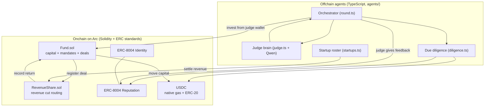
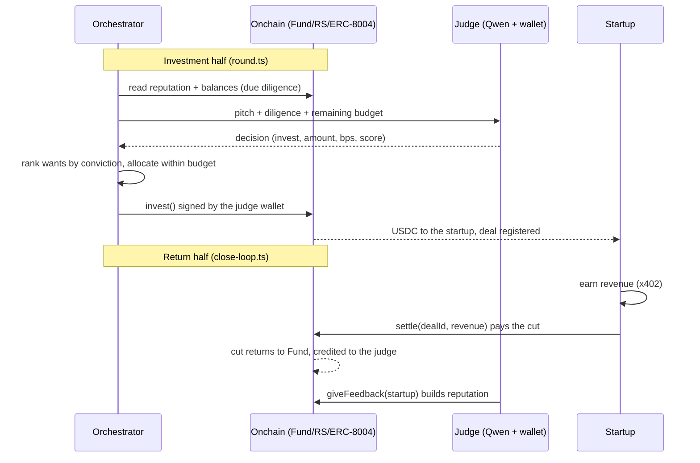

# Agenture — Technical Architecture

Agenture is an autonomous venture fund that runs agent to agent, settled onchain in USDC on Arc. AI judge agents hear pitches from startup agents, run due diligence on real onchain records, and each judge independently decides whether to invest from its own wallet. Funded startups earn revenue and stream a share back to the fund. No human is in the loop except liquidity providers depositing or withdrawing at the edges. Think Shark Tank, run by AI, settled in real stablecoin.

Built for the Encode x Arc Programmable Money Hackathon, Agentic Economy track.

## The mental model

- A **judge** is an established entrepreneur agent. It has its own onchain identity and track record, a persona (an investing thesis), a wallet, and a spending mandate from the shared fund.
- A **startup** is any non judge agent. It shows up with an idea, some self reported revenue or estimated worth, and an ask. Some already run a real service and earn; some are pre revenue.
- The **fund** is a shared capital pool. Each judge is allotted a mandate (a spending cap). Judges invest from their own wallets, so every decision is authorized onchain by the judge that made it.
- **Revenue share** is how the fund gets paid back. Each deal carries a revenue share in basis points; when a startup settles revenue, that cut streams to the fund and is credited to the judge that made the deal.
- **Reputation** is the memory of the system. After a deal, the judge rates the startup on ERC-8004. That score is exactly what the next round's due diligence reads back, so the fund learns across rounds.

## System overview



## The two layers

### Onchain layer (contracts/)

Everything that must be trustless lives onchain. All amounts use the 6 decimal USDC view.

**Fund.sol** is the capital pool and the book of record.
- `depositCapital(amount)`: anyone (an LP or the operator) funds the pool.
- `registerJudge(judge, agentId, mandate)`: operator only. Onboards a judge wallet with its ERC-8004 agentId and a spending cap.
- `invest(startup, amount, revenueShareBps, pitchRef)`: called by a judge's own wallet. Checks the caller is an active judge, that the amount fits under the judge's remaining mandate and the fund's cash, registers the deal with RevenueShare, and transfers USDC to the startup. Returns a `dealId` and emits `Invested`.
- `recordReturn(dealId, amount)`: RevenueShare only. Credits a returned cut to the deal and its judge.
- Views: `cash()`, `nav()` (cash plus the cost basis of live positions), `getJudge`, `getDeal`, `judgeRoiBps`.

**RevenueShare.sol** routes returns.
- `registerDeal(dealId, startup, bps)`: Fund only. Records the terms for a deal.
- `settle(dealId, revenueAmount)`: the startup only. The startup reports revenue and pays the fund's cut. It computes `cut = revenueAmount * bps / 10000`, pulls that cut from the startup in USDC, and calls `Fund.recordReturn`. Only the cut moves; the rest is already the startup's.

**ERC-8004** (external standard, live on Arc as proxies) is the agent identity and reputation layer.
- Identity: `register(uri)` mints an agentId to the caller.
- Reputation: `giveFeedback(agentId, value, decimals, tag1, tag2, endpoint, uri, hash)` lets a client (a judge) rate an agent (a startup). Self feedback is blocked, the rater must differ from the agent owner. `getSummary(agentId, clients[], tag1, tag2)` returns the count and averaged score across a named set of raters. Note: getSummary reverts on an empty client list, so a caller must pass the raters it trusts.

**USDC** on Arc is both the native gas token and an ERC-20 at `0x3600...0000`, the same pool viewed two ways. It is standard Circle USDC v2, so it supports EIP-3009 and EIP-2612. That is what makes x402 settle Arc native.

### Offchain layer (agents/)

The agents are TypeScript on the Vercel AI SDK and viem. Every model call goes through one seam.

- **config.ts / chain.ts**: the Arc chain definition, a read only public client, and `walletFromKey` for signing. `withRpcRetry` and `waitReceipt` wrap every read and receipt wait in a long backoff, because the public Arc RPC has a tight request quota and returns "request limit reached" on bursts.
- **llm.ts**: the single model seam. Today it points at Qwen 2.5 7B on 0G compute through an OpenAI compatible endpoint. `generateJson` asks for JSON and parses the first object robustly, returning null so callers can fall back safely. Swapping to a stronger model later is a one line change here.
- **judges.ts**: the judge personas (name, investing thesis, which env var holds the key), merged at run time with the wallet, agentId, and mandate from `addresses.json`. Keys are read from the environment only when a transaction is about to be signed.
- **startups.ts**: the fixture roster of startup agents, each with a wallet, an optional ERC-8004 agentId, a key reference for settling, and a pitch (idea, self reported revenue, estimated worth, ask).
- **diligence.ts**: gathers the real onchain picture for a startup: its ERC-8004 reputation aggregated over the fund's trusted raters, and its live USDC wallet balance. This is what the judge reasons over, independent of what the pitch claims.
- **judge.ts**: the brain. It builds a persona system prompt and a pitch plus diligence user prompt, asks the model, and coerces the result into a decision (invest, amount, revenue share bps, a conviction score, and a rationale), clamped to the judge's remaining mandate and the fund's cash. A parse failure becomes a safe pass.
- **fund.ts / identity.ts / feedback.ts / revenue.ts**: thin onchain action wrappers (invest, register identity, give feedback, pay revenue and settle).
- **round.ts / setup.ts / close-loop.ts**: the runnable entry points (see Running below).

## The round lifecycle

A round is one full turn of the fund. It has two halves: the investment half (built into `round.ts`) and the return half (built into `close-loop.ts`, to be merged into a single automated loop later).



Step by step:

1. **Intake.** A cohort of startup pitches is present in the arena.
2. **Due diligence.** For each startup the orchestrator reads real onchain signals once, reputation and live balance, paced under the RPC quota.
3. **Decision.** Each judge, independently, reasons over every pitch with its own persona and returns a decision with a conviction score.
4. **Rank then allocate.** Each judge sorts the pitches it wants by conviction and funds them in order until its mandate or the fund's cash runs out. This is why the batched arena matters: a judge compares the whole cohort before spending scarce budget, instead of committing to whoever pitched first.
5. **Invest.** For each funded pitch the judge's own wallet signs `Fund.invest`. The deal is registered with RevenueShare and USDC moves to the startup.
6. **Earn.** The startup runs its service and earns USDC. In a full deployment this is x402 revenue.
7. **Settle.** The startup calls `RevenueShare.settle`, paying the fund's cut. The rest stays with the startup.
8. **Feedback.** The deal's judge rates the startup on ERC-8004. That score is what the next round's due diligence reads, closing the loop.

## The arena model

Agenture uses **continuous intake with periodic closing rounds**.

- Startups can enter the arena at any time. Nothing happens to them on arrival, they wait.
- A round closes on a trigger (for now the operator runs it, in production a timer or cron, the same pattern as an hourly settlement round). At close, the cohort goes to the judges.
- Each judge still decides independently from its own wallet. The round is the timing and batching, not a group vote. Three judges, three opinions.

This beats deciding per arrival because a judge can rank the whole cohort and spend its scarce mandate on the best pitches, and because a round is a clean unit to demo and to reason about. An onchain Arena registry where startups self submit their pitches is a natural later layer; today the roster is a fixture.

## Wallets and the trust model

Authorization is expressed by who signs each transaction.

- **Operator** (the deployer wallet) is the fund admin. It deposits capital, registers judges, and, in the current earning stand in, plays the paying customer. It is the only address that can onboard judges.
- **Judge wallets** sign their own investments and their own feedback. The Fund checks the caller is a registered active judge, so a judge cannot spend beyond its mandate and no one else can invest on its behalf.
- **Startup wallets** sign their own settlements. RevenueShare checks the caller is the deal's startup, so only the startup can report and pay its own revenue.

Every private key lives in a gitignored `.env` and is read only at signing time. Nothing signs on behalf of another role.

## Configuration and secrets

- `shared/addresses.json` is the single source of truth: chain id, RPC, explorer, USDC, the ERC-8004 and ERC-8183 addresses, and the Agenture deployment (Fund, RevenueShare, operator, and the judges with their wallets, agentIds, and mandates). Both the agents and a future frontend read it.
- `agents/.env` (gitignored) holds the LLM endpoint and the private keys: the three judge keys, the operator key, the startup keys, and the client key. `.env.example` documents every variable.
- Startup keys exist so startups can settle their own revenue. Cold start startups got fresh throwaway keys; MeshRelay reuses the earlier client wallet.

## Current deployed state (Arc testnet, chain id 5042002)

- USDC: `0x3600000000000000000000000000000000000000`
- Fund: `0xa28Aa701E6390d477937F9F9F634840f75B84bEf`
- RevenueShare: `0x0D9cCC9A04BB518Cbd704afA7C9394aC50ef6f7f`
- Operator: `0x3E6AAfA597fC658cF5b7E42a9F07711785a9519E`
- ERC-8004 Identity / Reputation / Validation and the ERC-8183 job escrow: see `addresses.json`

Judges (each mandate 6 USDC):

| Judge | Persona | Wallet | agentId |
| --- | --- | --- | --- |
| Alpha | proven traction, disciplined | `0x7F2733B9...A7de` | 851598 |
| Nova | growth, high risk tolerance | `0xf2fD1775...a9F7` | 851659 |
| Sable | conservative value | `0x62050AB7...3467` | 851660 |

Startups (fixture roster):

| Startup | agentId | Note |
| --- | --- | --- |
| MeshRelay | 851590 | real reputation, real balance |
| PixelForge | 851661 | pre revenue, rated after its first deal |
| DataOracle | 851662 | cold start |

Deals so far: #0 the deploy spike, #1 and #2 Alpha into MeshRelay and PixelForge (both settled and rated), #3 and #4 Nova into MeshRelay and PixelForge, #5 Sable into MeshRelay. In the last round the three judges diverged exactly along their theses: Sable passed on both pre revenue startups, Nova funded the cold start PixelForge at a higher revenue share to price the risk.

## What is real and what is stubbed

- Real: the contracts, the mandates and deal accounting, the ERC-8004 identity and reputation reads and writes, the USDC movements, the judge decisions from a live model over live onchain data, and rank then allocate.
- Stubbed for now: the earning step. A startup's revenue is currently a USDC transfer from the operator standing in for a customer. The seam for real x402 is in `revenue.ts`, a real deployment settles earnings with EIP-3009 transferWithAuthorization.

## Not yet built (roadmap)

- Real x402 earning for startups, replacing the operator transfer stand in.
- A single automated loop that runs a round and then closes it, on a timer or cron, so rounds are fully autonomous.
- An onchain Arena registry where startups self submit pitches, replacing the fixture roster.
- The frontend (web/): an arena view, a fund dashboard, and an LP panel.
- Judge to judge and portfolio level reputation, and withdrawal for LPs.

## Running

From `agents/` (needs `agents/.env`, see `.env.example`):

```bash
bun install
bun run typecheck              # type check everything
DRY_RUN=1 bun run round        # preview decisions, no capital moves
bun run round                  # a live round: judges invest from their own wallets
bun run close-loop 1,2         # settle revenue and write feedback for the given deals
bun run setup                  # operator only, one time: deposit, onboard judges (SKIP_DEPOSIT=1 to resume)
```

From `contracts/`:

```bash
forge test                     # unit tests for Fund and RevenueShare
```

Testnet only. Nothing here is audited.
