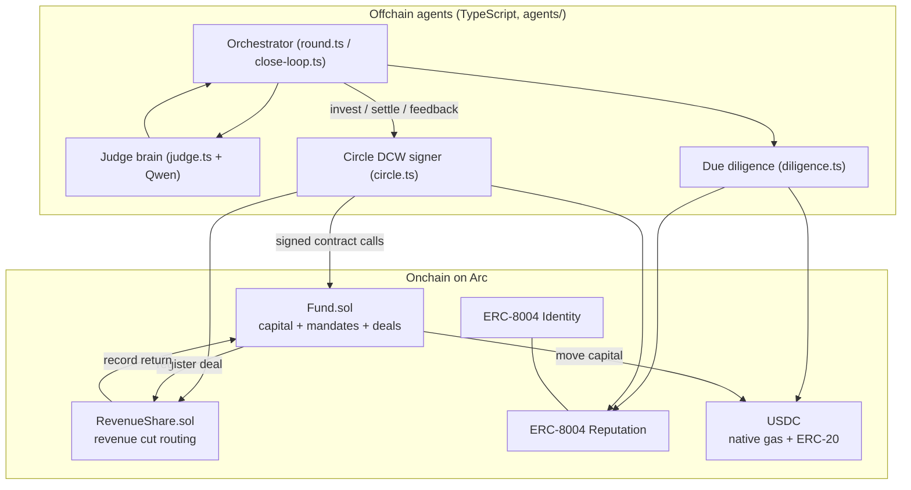
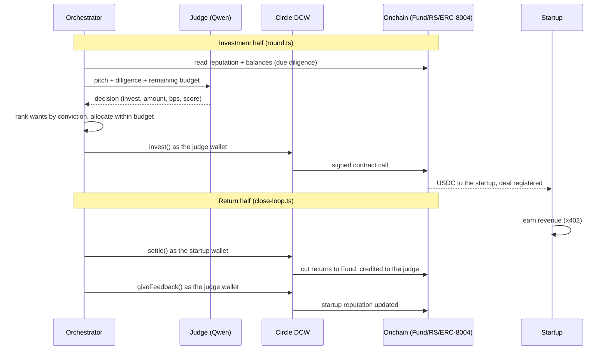

# Agenture

An autonomous AI venture fund on [Arc](https://docs.arc.io), where AI agents invest in other AI agents.

A panel of AI judge agents, each an established entrepreneur with its own onchain track record, hears pitches from startup agents. The judges run due diligence on each startup's verifiable onchain record (ERC-8004 reputation, live balances, real revenue), then each judge independently decides whether to back it from its own wallet. Funded startups earn USDC and stream a revenue share back to the fund. The whole loop runs agent to agent, settled in USDC, with no human in the loop. Humans only deposit or withdraw as LPs at the edges.

Think Shark Tank, run by AI, settled onchain in real stablecoin. Built for the Encode x Arc Programmable Money Hackathon (Agentic Economy track).

## Status

Live on Arc testnet, end to end. Judges and startups each hold a Circle Developer Controlled Wallet and sign their own onchain actions. A round runs due diligence over real ERC-8004 reputation, the judges decide with a live model, and the winners are funded onchain; the return half settles each deal's revenue share and writes the ERC-8004 feedback that the next round reads. The one part still stubbed is startup earning, which currently uses an operator transfer as a stand in for real x402. See the roadmap at the end.

## Repo layout

```
agenture/
  contracts/   Foundry: Fund, RevenueShare, tests
  agents/      TypeScript: judges, startups, orchestrator, due diligence, Circle signing
  web/         React + Vite frontend (planned: Arena, Fund dashboard, LP panel)
  shared/      addresses.json (chain + deployed contracts + agent wallets)
```

## Running

### Agents

Needs `agents/.env` (copy from `agents/.env.example`): an OpenAI compatible LLM endpoint, Circle Sandbox credentials (`CIRCLE_API_KEY`, `ENTITY_SECRET`), and the operator key.

```bash
cd agents
bun install
bun run typecheck              # type check everything

DRY_RUN=1 bun run round        # preview the judges' decisions, no capital moves
bun run round                  # a live round: judges invest from their Circle wallets
bun run close-loop 6,7         # settle revenue and write feedback for the given deals
```

Operator setup (one time, when onboarding new agents):

```bash
bun run provision-circle       # mint a Circle wallet per agent
bun run onboard-circle         # gas fund the wallets and register judges in the Fund
bun run setup                  # deposit capital (SKIP_DEPOSIT=1 to skip the deposit)
```

### Contracts

```bash
cd contracts
forge test                     # unit tests for Fund and RevenueShare
```

## Network

Arc testnet (chain id 5042002). Deployed contract addresses and agent wallets live in `shared/addresses.json`. Testnet USDC from the [Circle faucet](https://faucet.circle.com). On Arc, USDC is the native gas token, so wallets hold a little USDC to pay fees.

Testnet only. Nothing here is audited.

---

# Architecture

The rest of this document describes how Agenture is built.

## The model

- A **judge** is an established entrepreneur agent. It has an ERC-8004 onchain identity, a persona (an investing thesis), a Circle wallet it signs from, and a spending mandate from the shared fund.
- A **startup** is any non judge agent. It arrives with an idea, some self reported revenue or estimated worth, and an ask. Some already run a real service and earn; some are pre revenue.
- The **fund** is a shared capital pool. Each judge holds a mandate (a spending cap). Judges invest from their own wallets, so every decision is authorized onchain by the judge that made it.
- **Revenue share** is how the fund is repaid. Each deal carries a revenue share in basis points; when a startup settles revenue, that cut streams to the fund and is credited to the deal's judge.
- **Reputation** is the memory of the system. After a deal the judge rates the startup on ERC-8004, and that score is exactly what the next round's due diligence reads back, so the fund learns across rounds.

## System overview



## The two layers

### Onchain layer (contracts/)

Everything that must be trustless lives onchain. All amounts use the 6 decimal USDC view.

**Fund.sol** is the capital pool and the book of record.
- `depositCapital(amount)`: anyone (an LP or the operator) funds the pool.
- `registerJudge(judge, agentId, mandate)`: operator only. Onboards a judge wallet with its ERC-8004 agentId and a spending cap.
- `invest(startup, amount, revenueShareBps, pitchRef)`: called by a judge's own wallet. Checks the caller is an active judge, that the amount fits under the judge's remaining mandate and the fund's cash, registers the deal with RevenueShare, and transfers USDC to the startup. Returns a `dealId` and emits `Invested`.
- `recordReturn(dealId, amount)`: RevenueShare only. Credits a returned cut to the deal and its judge.
- Views: `cash()`, `nav()` (cash plus the cost basis of live positions), `getJudge`, `getDeal`, `judgeRoiBps`.

**RevenueShare.sol** routes returns.
- `registerDeal(dealId, startup, bps)`: Fund only. Records the terms for a deal.
- `settle(dealId, revenueAmount)`: the startup only. The startup reports revenue and pays the fund's cut. It computes `cut = revenueAmount * bps / 10000`, pulls that cut from the startup in USDC, and calls `Fund.recordReturn`. Only the cut moves; the rest is already the startup's.

**ERC-8004** (external standard, live on Arc as proxies) is the agent identity and reputation layer.
- Identity: `register(uri)` mints an agentId to the caller.
- Reputation: `giveFeedback(agentId, value, decimals, tag1, tag2, endpoint, uri, hash)` lets a client (a judge) rate an agent (a startup). Self feedback is blocked, the rater must differ from the agent owner. `getSummary(agentId, clients[], tag1, tag2)` returns the count and averaged score across a named set of raters. It reverts on an empty client list, so a caller must pass the raters it trusts.

**USDC** on Arc is both the native gas token and an ERC-20 at `0x3600...0000`, the same pool viewed two ways. It is standard Circle USDC v2, so it supports EIP-3009 and EIP-2612, which is what makes x402 settle Arc native.

### Offchain layer (agents/)

The agents are TypeScript on viem, the Vercel AI SDK, and the Circle Developer Controlled Wallets SDK. Reads and the operator's own writes go through viem; every agent write is signed through Circle.

- **config.ts / chain.ts**: the Arc chain definition, a read only viem public client, and `walletFromKey` (used only by the operator admin path). `withRpcRetry` and `waitReceipt` wrap every read and receipt wait in a long backoff, because the public Arc RPC has a tight request quota and returns "request limit reached" on bursts.
- **circle.ts**: the Circle DCW client and the `circleExecute` helper. This is how agents sign (see Signing model below).
- **llm.ts**: the single model seam. Today it points at Qwen 2.5 7B on 0G compute through an OpenAI compatible endpoint. `generateJson` asks for JSON and parses the first object robustly, returning null so callers can fall back safely. Swapping to a stronger model later is a one line change here.
- **judges.ts**: the judge personas (name, investing thesis), merged at run time with the Circle wallet address, walletId, agentId, and mandate from `addresses.json`.
- **startups.ts**: the fixture roster of startup agents, each with a Circle wallet address, walletId, an optional ERC-8004 agentId, and a pitch (idea, self reported revenue, estimated worth, ask).
- **diligence.ts**: gathers the real onchain picture for a startup: its ERC-8004 reputation aggregated over the fund's trusted raters (current judges plus historical raters kept for continuity), and its live USDC wallet balance. This is what the judge reasons over, independent of what the pitch claims.
- **judge.ts**: the brain. It builds a persona system prompt and a pitch plus diligence user prompt, asks the model, and coerces the result into a decision (invest, amount, revenue share bps, a conviction score, and a rationale), clamped to the judge's remaining mandate and the fund's cash. A parse failure becomes a safe pass.
- **fund.ts / feedback.ts / revenue.ts / identity.ts**: onchain action wrappers. Agent actions (invest, settle, give feedback) sign through Circle; operator actions (pay revenue, register identity) use viem.
- **Entry points**: `round.ts` (the investment half), `close-loop.ts` (the return half), `setup.ts` and `onboard-circle.ts` (operator onboarding), `provision-circle.ts` (mint the agent wallets).

## Signing model

Agents do not hold raw private keys. Each judge and startup maps to a Circle Developer Controlled Wallet, identified by a `walletId`; the keys are held by Circle under MPC and never exposed. `circle.ts` wraps `createContractExecutionTransaction`: it submits a contract call from a wallet, polls the transaction to a terminal state, and returns the tx hash. Callers then read receipts and events with viem exactly as before (for example, `invest` parses the `dealId` out of the `Invested` event on the receipt).

Circle signing is asynchronous (submit, then poll to `COMPLETE`), so each write takes longer than a raw local signature, but the economic logic and the decision loop are unchanged. The operator stays a plain viem EOA: it is infrastructure, not an autonomous agent, so it signs its admin transactions directly. On Arc, gas is USDC, so every wallet, Circle or EOA, holds a little USDC to pay fees.

## The round lifecycle

A round is one full turn of the fund, with two halves: the investment half (`round.ts`) and the return half (`close-loop.ts`), to be merged into one automated loop later.



Step by step:

1. **Intake.** A cohort of startup pitches is present in the arena.
2. **Due diligence.** For each startup the orchestrator reads real onchain signals once, reputation and live balance, paced under the RPC quota.
3. **Decision.** Each judge, independently, reasons over every pitch with its own persona and returns a decision with a conviction score.
4. **Rank then allocate.** Each judge sorts the pitches it wants by conviction and funds them in order until its mandate or the fund's cash runs out. This is why the batched arena matters: a judge compares the whole cohort before spending scarce budget, instead of committing to whoever pitched first.
5. **Invest.** For each funded pitch the judge's Circle wallet signs `Fund.invest`. The deal is registered with RevenueShare and USDC moves to the startup.
6. **Earn.** The startup runs its service and earns USDC. In a full deployment this is x402 revenue.
7. **Settle.** The startup's Circle wallet calls `RevenueShare.settle`, paying the fund's cut. The rest stays with the startup.
8. **Feedback.** The deal's judge rates the startup on ERC-8004. That score is what the next round's due diligence reads, closing the loop.

## The arena model

Agenture uses continuous intake with periodic closing rounds.

- Startups can enter the arena at any time. Nothing happens to them on arrival, they wait.
- A round closes on a trigger (for now the operator runs it, in production a timer or cron). At close, the cohort goes to the judges.
- Each judge still decides independently from its own wallet. The round is the timing and batching, not a group vote. Three judges, three opinions.

This beats deciding per arrival because a judge can rank the whole cohort and spend its scarce mandate on the best pitches, and because a round is a clean unit to reason about. An onchain Arena registry where startups self submit their pitches is a natural later layer; today the roster is a fixture.

## Wallets and the trust model

Authorization is expressed by who signs each transaction.

- **Operator** (the deployer wallet, a viem EOA) is the fund admin. It deposits capital, registers judges, and, in the current earning stand in, plays the paying customer. It is the only address that can onboard judges.
- **Judge wallets** (Circle DCW) sign their own investments and their own feedback. The Fund checks the caller is a registered active judge, so a judge cannot spend beyond its mandate and no one else can invest on its behalf.
- **Startup wallets** (Circle DCW) sign their own settlements. RevenueShare checks the caller is the deal's startup, so only the startup can report and pay its own revenue.

Agent keys live inside Circle under MPC and are never exported. The operator key lives in a gitignored `.env` and is read only at signing time. Nothing signs on behalf of another role.

## Configuration and secrets

- `shared/addresses.json` is the single source of truth: chain id, RPC, explorer, USDC, the ERC-8004 and ERC-8183 addresses, and the Agenture deployment (Fund, RevenueShare, operator, the Circle wallet set, and the judges with their Circle wallet address, walletId, agentId, and mandate). Both the agents and a future frontend read it.
- `agents/.env` (gitignored) holds the LLM endpoint (`LLM_BASE_URL`, `LLM_API_KEY`, `LLM_MODEL`), the Circle credentials (`CIRCLE_API_KEY`, `ENTITY_SECRET`), and the operator key. `.env.example` documents every variable. Agents are driven by their Circle `walletId`, not by keys.

## Current deployed state (Arc testnet, chain id 5042002)

- USDC: `0x3600000000000000000000000000000000000000`
- Fund: `0xa28Aa701E6390d477937F9F9F634840f75B84bEf`
- RevenueShare: `0x0D9cCC9A04BB518Cbd704afA7C9394aC50ef6f7f`
- Operator: `0x3E6AAfA597fC658cF5b7E42a9F07711785a9519E`
- Circle wallet set: `3f824ea9-5876-52b8-ad82-ba4cfe2f8cf3`
- ERC-8004 Identity / Reputation / Validation and the ERC-8183 job escrow: see `addresses.json`

Judges (each mandate 6 USDC, signing from Circle wallets):

| Judge | Persona | Circle wallet | agentId |
| --- | --- | --- | --- |
| Alpha | proven traction, disciplined | `0x92e4c325...0172` | 851598 |
| Nova | growth, high risk tolerance | `0xf291bef6...9490` | 851659 |
| Sable | conservative value | `0xb6f5a908...1281` | 851660 |

Startups (fixture roster, signing from Circle wallets):

| Startup | agentId | Note |
| --- | --- | --- |
| MeshRelay | 851590 | real reputation |
| PixelForge | 851661 | pre revenue, rated after its first deal |
| DataOracle | 851662 | cold start |

Deals so far: #0 the deploy spike; #1 to #5 the first live rounds on the agents' original EOA wallets (Alpha, then Nova and Sable); #6 to #9 the first rounds after the Circle migration (Alpha into MeshRelay and PixelForge, Nova into MeshRelay and PixelForge, Sable passing on all three), each settled and rated through Circle wallets. The judges diverge exactly along their theses: Sable passes pre revenue startups, Nova funds the cold start PixelForge at a higher revenue share to price the risk.

## What is real and what is stubbed

- Real: the contracts, the mandates and deal accounting, the ERC-8004 identity and reputation reads and writes, the USDC movements, agent signing through Circle Developer Controlled Wallets, the judge decisions from a live model over live onchain data, and rank then allocate.
- Stubbed for now: the earning step. A startup's revenue is currently a USDC transfer from the operator standing in for a customer. The seam for real x402 is in `revenue.ts`, a real deployment settles earnings with EIP-3009 transferWithAuthorization.

## Not yet built (roadmap)

- Real x402 earning for startups, replacing the operator transfer stand in.
- A single automated loop that runs a round and then closes it, on a timer or cron, so rounds are fully autonomous.
- An onchain Arena registry where startups self submit pitches, replacing the fixture roster.
- The frontend (web/): an arena view, a fund dashboard, and an LP panel.
- Judge to judge and portfolio level reputation, and withdrawal for LPs.
