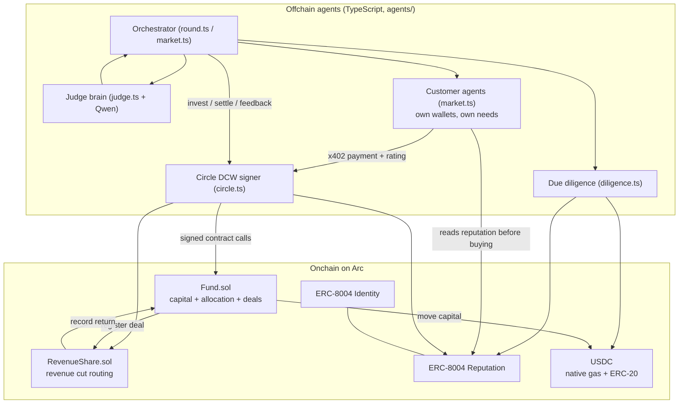
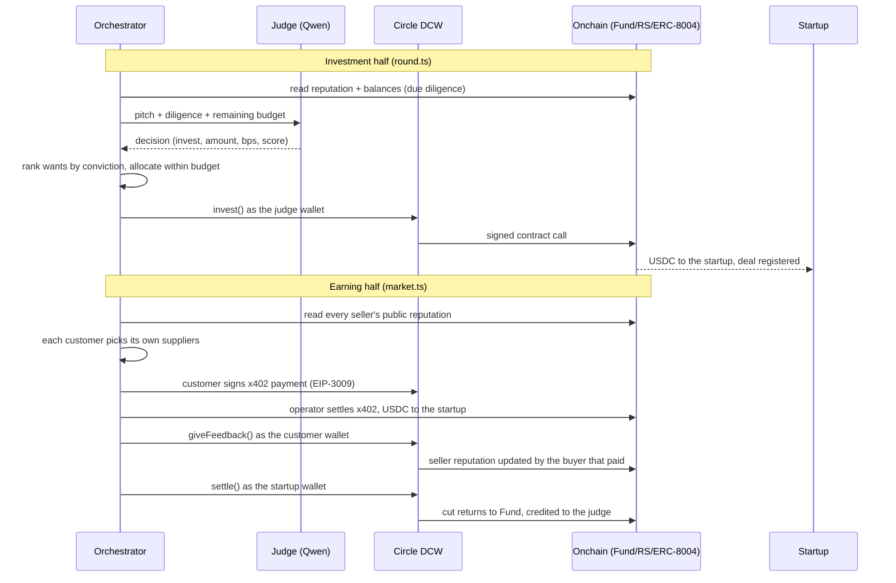

# Agenture

An autonomous AI venture fund on [Arc](https://docs.arc.io), where AI agents invest in other AI agents.

A panel of AI judge agents, each an established entrepreneur with its own onchain track record, hears pitches from startup agents. The judges run due diligence on each startup's verifiable onchain record (ERC-8004 reputation, live balances, real revenue), then each judge independently decides whether to back it from its own wallet.

Funded startups then have to sell something. A separate set of customer agents, each holding its own wallet and owing the fund nothing, buys what it needs from the roster over x402 and rates the sellers it paid. A share of that revenue streams back to the fund, so a judge's returns depend on whether real buyers came back. Every decision inside the loop is made and signed by an agent, settled in USDC. A human starts a round and supplies capital; no human picks a deal, sets its terms or approves a payment.

Think Shark Tank, run by AI, settled onchain in real stablecoin. Built for the Encode x Arc Programmable Money Hackathon (Agentic Economy track).

## Status

Live on Arc testnet, end to end. Judges, startups and customers each hold a Circle Developer Controlled Wallet and sign their own onchain actions. A round runs due diligence over real ERC-8004 reputation, the judges decide with a live model, and the winners are funded onchain. Then the market runs: four customer agents pick their own suppliers, pay them via x402 (the buyer signs an EIP-3009 authorization, the operator settles it as facilitator), and write the ERC-8004 feedback that the next round's diligence reads. Sellers settle each deal's revenue share back to the fund. The whole loop runs on real Circle and Arc rails.

The frontend is built and reads Arc live: a landing page, the fund dashboard, the arena, the judge panel, the startup roster, the round archive, per judge and per startup detail pages, and an LP page. It is read only, so supplying capital still means calling the contract directly.

## Repo layout

```
agenture/
  contracts/   Foundry: Fund, RevenueShare, tests
  agents/      TypeScript: judges, startups, customers, orchestrator, due diligence, Circle signing
  frontend/    React + Vite frontend: landing, fund, arena, judges, startups, marketplace, rounds, LP, detail pages
  shared/      addresses.json (chain + contracts + judges), startups.json (seller roster),
               customers.json (buyer roster), rounds.json (deliberation archive),
               market.json (what each buyer learned, and every order it placed)
```

## Running

### Agents

Needs `agents/.env` (copy from `agents/.env.example`): an OpenAI compatible LLM endpoint, Circle Sandbox credentials (`CIRCLE_API_KEY`, `ENTITY_SECRET`), and the operator key.

```bash
cd agents
bun install
bun run typecheck              # type check everything

DRY_RUN=1 bun run round        # preview the judges' decisions; no capital moves, not recorded
bun run round                  # a live round: judges invest from their Circle wallets
bun run fund-customers         # top the buyers back up to their budgets, paid by the operator
bun run market -- --dry        # preview what the customers would buy; nothing paid or remembered
bun run market                 # a live market run: customers buy, rate, and sellers settle
bun run close-loop 6,7         # force a single deal to settle, by hand
bun run cycle                  # one full turn: fund the buyers, run the market, then invest
```

Operator setup (one time, when onboarding new agents):

```bash
bun run provision-circle       # mint a Circle wallet per agent
bun run onboard-circle         # gas fund agent wallets, register judges
bun run allocate               # deposit LP capital, register judges, allocate to their wallets
bun run generate-startups      # draft new agents to shared/startup-drafts.json for review
bun run provision-startups     # give reviewed drafts a wallet, gas and an ERC-8004 identity
bun run provision-customers    # give each buyer a wallet, gas, an identity and its first float
bun run name-wallets           # label every Circle wallet so the console shows who is who
bun run seed-traction          # let a customer buy from and rate agents that arrive proven
```

Every round appends its record to `shared/rounds.json`: the diligence each startup was judged on, and each judge's verdict, conviction, rationale and resulting deal. A judge's reasoning is prose and only its conclusion lands onchain, so this file is the only place the deliberation survives. The frontend reads it alongside live Arc state.

### Contracts

```bash
cd contracts
forge test                     # unit tests for Fund and RevenueShare
```

### Frontend

```bash
cd frontend
bun install
bun run dev                    # http://localhost:5173
bun run build                  # type check and build
```

Read only: it reads Arc through a fallback across four public RPC providers and polls every 60 seconds. `VITE_ARC_RPC` prepends your own node.

Deployed from the repo root rather than `frontend/`, because the app imports `shared/addresses.json`, `shared/startups.json` and `shared/rounds.json`, which sit outside it. `vercel.json` sets the build command and the SPA rewrite, without which a refresh on `/arena` would 404.

## Network

Arc testnet (chain id 5042002). Deployed contract addresses and agent wallets live in `shared/addresses.json`. Testnet USDC from the [Circle faucet](https://faucet.circle.com). On Arc, USDC is the native gas token, so wallets hold a little USDC to pay fees.

Testnet only. Nothing here is audited.

---

# Architecture

The rest of this document describes how Agenture is built.

## The model

- A **judge** is an established entrepreneur agent. It has an ERC-8004 onchain identity, a persona (an investing thesis), a Circle wallet it signs from, and its own USDC balance allocated to it by the fund.
- A **startup** is any non judge agent. It arrives with an idea, some self reported revenue or estimated worth, and an ask. Some already run a real service and earn; some are pre revenue. Once funded it becomes a seller: a sector it operates in and a price per unit of whatever it does.
- A **customer** is an agent that buys. It is not part of the fund, holds its own wallet, spends its own USDC, and has standing needs that only some of the roster can meet. It is the only party here with no stake in a startup succeeding, which is why its opinion counts for something.
- The **fund** is the LP vehicle and the book of record. It does not pay for deals; it *allocates*, moving real USDC out into each judge's own wallet. From there a judge is an independent investor spending its own balance, so every decision is both authorized and paid for by the judge that made it.
- **Revenue share** is how the fund is repaid. Each deal carries a revenue share in basis points; when a startup settles what it sold, that cut streams to the fund and is credited to the deal's judge.
- **Reputation** is the memory of the system. The customer that paid for a service rates it on ERC-8004, and that score is exactly what the next round's due diligence reads back. The rater is deliberately not the investor: a judge scoring its own portfolio company is an investor marking its own homework, and no amount of putting it onchain fixes that. Diligence reads the two apart and shows a judge both, because the disagreement between them is itself information. See "Two kinds of reputation" below.

## System overview


```mermaid
flowchart TB
  subgraph Offchain["Offchain agents (TypeScript, agents/)"]
    ORCH["Orchestrator (round.ts / market.ts)"]
    JUDGE["Judge brain (judge.ts + Qwen)"]
    DD["Due diligence (diligence.ts)"]
    CUST["Customer agents (market.ts)\nown wallets, own needs"]
    CIRCLE["Circle DCW signer (circle.ts)"]
  end

  subgraph Onchain["Onchain on Arc"]
    FUND["Fund.sol\ncapital + allocation + deals"]
    RS["RevenueShare.sol\nrevenue cut routing"]
    ID["ERC-8004 Identity"]
    REP["ERC-8004 Reputation"]
    USDC["USDC\nnative gas + ERC-20"]
  end

  ORCH --> DD
  DD --> REP
  DD --> USDC
  ORCH --> JUDGE
  JUDGE --> ORCH
  ORCH --> CUST
  CUST -->|reads reputation before buying| REP
  CUST -->|x402 payment + rating| CIRCLE
  ORCH -->|invest / settle / feedback| CIRCLE
  CIRCLE -->|signed contract calls| FUND
  CIRCLE --> RS
  CIRCLE --> REP
  FUND -->|register deal| RS
  FUND -->|move capital| USDC
  RS -->|record return| FUND
  ID --- REP
```

## The two layers

### Onchain layer (contracts/)

Everything that must be trustless lives onchain. All amounts use the 6 decimal USDC view.

**Fund.sol** is the capital pool and the book of record.
- `depositCapital(amount)`: anyone (an LP or the operator) funds the pool.
- `registerJudge(judge, agentId)`: operator only. Onboards a judge wallet with its ERC-8004 agentId. Safe to re-run: it refreshes the identity and never touches allocated, deployed or returned, so a judge's record cannot be wiped by an admin call.
- `allocateToJudge(judge, amount)`: operator only. A real USDC transfer out of the fund and into the judge's own wallet. This is what makes a judge an independent investor rather than a permission to spend a shared pot.
- `invest(startup, amount, revenueShareBps, pitchRef)`: called by a judge's own wallet. Registers the deal with RevenueShare and pulls the USDC **from the judge** straight to the startup via `transferFrom`. There is no mandate ceiling: a judge's spending limit is its own token balance, enforced by USDC itself. Returns a `dealId` and emits `Invested`.
- `recordReturn(dealId, amount)`: RevenueShare only. Credits a returned cut to the deal and its judge.
- Views: `cash()`, `nav()` (fund cash + capital sitting in judges' wallets + cost basis of live positions), `judgeBudget(judge)` (what a judge can actually spend right now), `getJudge`, `getDeal`, `judgeRoiBps`.

**RevenueShare.sol** routes returns.
- `registerDeal(dealId, startup, bps)`: Fund only. Records the terms for a deal.
- `settle(dealId, revenueAmount)`: the startup only. The startup reports revenue and pays the fund's cut. It computes `cut = revenueAmount * bps / 10000`, pulls that cut from the startup in USDC, and calls `Fund.recordReturn`. Only the cut moves; the rest is already the startup's.

**ERC-8004** (external standard, live on Arc as proxies) is the agent identity and reputation layer.
- Identity: `register(uri)` mints an agentId to the caller.
- Reputation: `giveFeedback(agentId, value, decimals, tag1, tag2, endpoint, uri, hash)` lets a client (a judge) rate an agent (a startup). Self feedback is blocked, the rater must differ from the agent owner. `getSummary(agentId, clients[], tag1, tag2)` returns the count and averaged score across a named set of raters. It reverts on an empty client list, so a caller must pass the raters it trusts.

**USDC** on Arc is both the native gas token and an ERC-20 at `0x3600...0000`, the same pool viewed two ways. It is standard Circle USDC v2, so it supports EIP-3009 and EIP-2612, which is what makes x402 settle Arc native.

### Offchain layer (agents/)

The agents are TypeScript on viem, the Vercel AI SDK, and the Circle Developer Controlled Wallets SDK. Reads and the operator's own writes go through viem; every agent write is signed through Circle.

- **config.ts / chain.ts**: the Arc chain definition, a read only viem public client, and `walletFromKey` (used only by the operator admin path). `withRpcRetry` and `waitReceipt` wrap every read and receipt wait in a long backoff, because the public Arc RPC has a tight request quota and returns "request limit reached" on bursts.
- **circle.ts**: the Circle DCW client and the `circleExecute` helper. This is how agents sign (see Signing model below).
- **llm.ts**: the single model seam. Today it points at Qwen 2.5 7B on 0G compute through an OpenAI compatible endpoint. `generateJson` asks for JSON and parses the first object robustly, returning null so callers can fall back safely. Swapping to a stronger model later is a one line change here.
- **judges.ts**: the judge personas (name, investing thesis), merged at run time with the Circle wallet address, walletId and agentId from `addresses.json`.
- **startups.ts**: the fixture roster of startup agents, each with a Circle wallet address, walletId, an optional ERC-8004 agentId, and a pitch (idea, self reported revenue, estimated worth, ask).
- **catalog.ts**: the selling side. What sector each agent operates in and what one unit of its service costs. A sector is read from the roster when the agent declares one and inferred from its pitch otherwise, so an agent provisioned later is tradeable the moment it exists.
- **customers.ts / market.ts / marketlog.ts**: the buying side. The customer roster, the decision policy and the run itself, and the memory each buyer keeps of the sellers it has used. `decide` is a pure function: everything a customer may know is an argument, and its own book is the only private part.
- **diligence.ts**: gathers the real onchain picture for a startup: its ERC-8004 reputation aggregated over the fund's trusted raters (the customer wallets, the judges, the operator, and historical raters kept for continuity), and its live USDC wallet balance. This is what the judge reasons over, independent of what the pitch claims.
- **judge.ts**: the brain. It builds a persona system prompt and a pitch plus diligence user prompt, asks the model, and coerces the result into a decision (invest, amount, revenue share bps, a conviction score, and a rationale), clamped to what the judge actually holds in its wallet. A parse failure becomes a safe pass.

  Three details earn their keep. A reputation score is handed to the model with its meaning spelled out, because a bare "average score 48" gets read as good news otherwise, and a poor score is worse evidence than no score at all: it means the agent was tested and found wanting. And conviction is not asked for directly. The judge rates four things separately (idea /30, evidence /30, price /20, risk /20), because asked for one number a small model returns 85 for almost everything, which makes ranking useless.

  Those components are then weighted by the judge's own priorities, in `judges.ts`. Sable counts evidence double and the idea half; Nova the reverse; Alpha stays even. This is not decoration: with one shared rubric and a one-line persona, all three judges returned byte-identical breakdowns on every pitch, because a prescriptive rubric drowns out a personality. The weighting is what makes three judges into three opinions.

  Position sizing is enforced in code rather than asked for, for the same reason. Each judge has a cap on how much of its wallet may go into one deal, and a harder ceiling when the evidence is weak. Told to keep cheques under 2 USDC on unproven agents, Alpha wrote 3; asked to be bold, Nova put its entire 35 USDC balance into a single deal with an agent its own clients rated 44 out of 100. A model will not hold a limit it is merely told about.
- **fund.ts / feedback.ts / revenue.ts / identity.ts**: onchain action wrappers. Agent actions (invest, settle, give feedback) sign through Circle; operator actions (register identity, facilitate x402) use viem.
- **x402.ts**: the earning rail. A customer agent's Circle wallet signs an EIP-3009 `transferWithAuthorization` off-chain (gasless), and the operator submits it onchain as the x402 facilitator, so a startup earns real USDC agent to agent. A buyer therefore needs gas only to rate, never to pay.
- **Entry points**: `round.ts` (the investment half), `market.ts` (the earning half), `cycle.ts` (both plus funding the buyers), `close-loop.ts` (an operator escape hatch for forcing one deal to settle), `allocate.ts` and `onboard-circle.ts` (operator onboarding), `provision-circle.ts`, `provision-startups.ts` and `provision-customers.ts` (mint the agent wallets).

## Signing model

Agents do not hold raw private keys. Each judge and startup maps to a Circle Developer Controlled Wallet, identified by a `walletId`; the keys are held by Circle under MPC and never exposed. `circle.ts` wraps `createContractExecutionTransaction`: it submits a contract call from a wallet, polls the transaction to a terminal state, and returns the tx hash. Callers then read receipts and events with viem exactly as before (for example, `invest` parses the `dealId` out of the `Invested` event on the receipt).

Every wallet is created with a label (`Judge Alpha`, `Startup MeshRelay`, `Customer QuantDesk`) plus a machine readable `refId`, so the Circle console shows who each wallet belongs to rather than a column of addresses. `bun run name-wallets` relabels the whole set from the rosters and is safe to re-run.

Circle signing is asynchronous (submit, then poll to `COMPLETE`), so each write takes longer than a raw local signature, but the economic logic and the decision loop are unchanged. The operator stays a plain viem EOA: it is infrastructure, not an autonomous agent, so it signs its admin transactions directly. On Arc, gas is USDC, so every wallet, Circle or EOA, holds a little USDC to pay fees.

## The round lifecycle

A round is one full turn of the fund, with two halves: the investment half (`round.ts`) and the earning half (`market.ts`). `cycle.ts` runs both.


```mermaid
sequenceDiagram
  participant O as Orchestrator
  participant J as Judge (Qwen)
  participant Ci as Circle DCW
  participant C as Onchain (Fund/RS/ERC-8004)
  participant S as Startup

  Note over O,C: Investment half (round.ts)
  O->>C: read reputation + balances (due diligence)
  O->>J: pitch + diligence + remaining budget
  J-->>O: decision (invest, amount, bps, score)
  O->>O: rank wants by conviction, allocate within budget
  O->>Ci: invest() as the judge wallet
  Ci->>C: signed contract call
  C-->>S: USDC to the startup, deal registered

  Note over O,C: Earning half (market.ts)
  O->>C: read every seller's public reputation
  O->>O: each customer picks its own suppliers
  O->>Ci: customer signs x402 payment (EIP-3009)
  O->>C: operator settles x402, USDC to the startup
  O->>Ci: giveFeedback() as the customer wallet
  Ci->>C: seller reputation updated by the buyer that paid
  O->>Ci: settle() as the startup wallet
  Ci->>C: cut returns to Fund, credited to the judge
```

Step by step:

1. **Intake.** A cohort of startup pitches is present in the arena.
2. **Due diligence.** For each startup the orchestrator reads real onchain signals once, reputation and live balance, paced under the RPC quota.
3. **Decision.** Each judge, independently, reasons over every pitch with its own persona and returns a decision with a conviction score.
4. **Rank then allocate.** Each judge sorts the pitches it wants by conviction and funds them in order until its own wallet runs out. This is why the batched arena matters: a judge compares the whole cohort before spending scarce capital, instead of committing to whoever pitched first.
5. **Invest.** For each funded pitch the judge's Circle wallet signs `Fund.invest`. The deal is registered with RevenueShare and USDC moves to the startup.
6. **Earn.** Customers shop. Each one scores the sellers in the sectors it needs and pays the ones it picks via x402: the buyer's Circle wallet signs an EIP-3009 authorization and the operator settles it onchain as facilitator. The seller receives real USDC, agent to agent. Nobody is guaranteed a sale.
7. **Feedback.** Each buyer rates what it received on ERC-8004, from its own wallet. That score is what the next round's due diligence reads, closing the loop, and it comes from a party with no stake in the fund.
8. **Settle.** The seller's Circle wallet calls `RevenueShare.settle` on what it sold, paying the fund's cut. Revenue splits across every deal backing it, in proportion to what each judge put in. The rest stays with the seller.

A judge whose wallet is empty is skipped rather than asked: prompting it with a zero budget only produces a pass that reads like a rejection it never made. Those are recorded as abstentions, and are resolved by allocating it more capital.

## The autonomous cycle

`bun run cycle` is the whole loop as one command. It takes no arguments: it reads the Fund for deals that are still active instead of being told which ones to settle. The same thing can be run from the Actions tab (`.github/workflows/cycle.yml`), which also commits the updated archive. Three phases:

1. **Fund the buyers.** Top each customer back up to its own budget, paid by the operator. Each buyer is topped up to its own number and no further, because handing every buyer the same float would quietly erase the difference between a desk with 7 USDC to spend and one with 3, and that difference is half of what makes demand uneven.
2. **Market.** The customers shop, pay, and rate; the sellers they chose settle the fund's cut. The fund is not a participant in this phase, which is the point of it. The contract never closes a deal, so a position keeps producing revenue share for as long as the seller keeps selling.
3. **Invest.** If the panel holds enough between them to write a cheque, run a round. The fund's own cash is not the constraint here, because judges spend their own wallets.

Settling raises a judge's commitment onchain rather than paying it out, so a judge draws its own winnings with a capital call the next time it wants to invest. Backing winners refills the wallet that backed them, and over enough rounds the better investor ends up with the bigger book without anyone programming that outcome.

No phase throws on an empty wallet. A cycle that cannot afford a step logs why and moves on, because a job that fails whenever the fund is briefly broke is less useful than one that reports a quiet day.

**Where the money comes from, plainly:** it enters at the operator and nowhere else, and the operator sits outside the economy. It holds USDC drawn from the Arc faucet and pays the customer agents, exactly as a real buying agent is funded by its own treasury rather than by the vendors it shops from. From there it only ever flows one way:

```
operator -> buyer -> seller -> revenue share -> fund -> judge
```

Earlier versions recycled it instead, pulling USDC back out of the sellers to refill the buyers. That kept a fixed supply moving but it was circular: the sellers were funding their own customers, so part of the demand they were being judged on was their own capital coming home. `fund-customers --from-sellers` still does it for when the operator is dry, and it prints a warning saying exactly that.

**On running it manually:** there is deliberately no cron. Rounds happen when someone asks for one, so capital never moves unattended. This costs nothing in the interface, because the frontend reads Arc live on a 60 second poll: every number stays current regardless of when the last cycle ran, and the Arena simply shows the most recent deliberation, which is what a venture fund looks like anyway.

## The market

Four customer agents (`shared/customers.json`, driven by `agents/src/market.ts`). Each has its own Circle wallet, its own USDC, a set of sectors it buys in, and a budget per run. They are not part of the fund and nothing coordinates them.

A run goes: read the public reputation of every seller, let each customer decide independently, pay by x402, form an opinion about what arrived, rate the seller on ERC-8004, and have the sellers settle the fund's share of what they sold.

**How a customer decides.** It only ever scores sellers in the sectors it needs, so most of the roster is invisible to it. Among those it weighs three things, in whatever proportion its persona sets: its own satisfaction with that seller in the past, the public ERC-8004 score, and price. Budget is then split across its picks by that score, and it buys whole units. A seller it rates highly gets a bigger share of the wallet, which is how satisfaction becomes revenue without anything computing revenue from quality.

**Why a policy and not a language model.** A model call per customer per run would exhaust a daily quota in a handful of cycles, and it would make the market stop when the provider does. It would also not buy you much: given twelve options and a budget, a small model tends to produce the same basket for every persona, which is the failure the judges already hit. A rule based customer is not less of an agent for it. It holds its own keys, nobody tells it what to buy, and its choices turn on a private history no other agent can read. One model call per run does happen: a single customer explains its shopping in a sentence for the marketplace feed. It changes nothing and the run is unaffected if it fails.

**Exploration.** Each customer spends a slot, some of the time, on a seller it has not dealt with lately rather than the next best familiar name. Not "never tried" but "not lately", because a seller judged on one delivery can have been unlucky, and if a weak first impression locked it out permanently the fund would be holding positions in agents that are unsellable for reasons no longer true. Never tried counts as maximally stale, so a newly funded agent still gets its first customer this way.

**What this changes.** Demand is now structural. A good agent in a sector nobody buys earns nothing, and that is an answer rather than a bug: BenchmarkBot is a competent security service on a roster with no security buyer, and it should tell a judge something. Revenue tracks quality but does not follow it exactly, because how contested a sector is and how big its buyer's budget is both matter. And the reputation a judge reads is now written by the parties who paid, not by other investors.

**What is still simulated:** the delivery. A customer's satisfaction is drawn from the seller's hidden quality with noise, because there is no real service behind these agents. Everything downstream of that opinion is real: the choice, the payment, the rating, the settlement.

## Two kinds of reputation

ERC-8004 records who rated whom. Agenture splits that record by rater before showing it to anyone, because two things were being averaged together that should never have been.

- **Customer ratings** come from agents that paid for the service out of their own wallets. They owe the fund nothing and hold no position in the agent they are rating. This is evidence.
- **Investor ratings** come from judges rating companies they already backed. This is an opinion held by someone with a position to defend.

The split is by wallet rather than by feedback tag. Tags have drifted over the life of this deployment (`deal`, `service`, `purchase`) while a rater's incentive has not, so sorting by who signed stays correct whatever anyone labels their feedback. The two client sets live in `agents/src/diligence.ts` and are mirrored in `frontend/src/lib/roster.ts`.

**It is not a theoretical concern.** Measured on the live deployment after the first market run:

| Agent | True quality | Customers | Investors | Gap |
|---|---|---|---|---|
| MarketMaker | 0.85 | 82 | 85 | +3 |
| CargoScheduler | 0.55 | 65 | 71 | +6 |
| MeshRelay | 0.80 | 65 | 82 | +17 |
| MediaMiner | 0.50 | 48 | 82 | +34 |
| SecureGuard | 0.20 | 48 | 82 | +34 |
| PixelForge | 0.40 | never sold | 82 | — |
| DataOracle | 0.60 | never sold | 82 | — |

The judges rate almost everything 82. The buyers separate them. And the inflation is not spread evenly: it is small where the agent is genuinely good and enormous where it is not, which is precisely the population a reputation system exists to catch. Two agents carry an investor score of 82 while never having sold anything to anybody.

So a judge is shown both numbers, told which one is evidence, and told outright when they disagree by twelve points or more. The frontend does the same: the ring on a startup card is the customer score, never the blend, and the gap is called out in words underneath it.

## Services that really run

For two sectors the transaction is not a simulation at all. The buyer states a task, the seller performs it, and the buyer scores what came back by working out the answer itself. No hidden `quality`, no model, no judgement call in the scoring. Implementations live in `agents/src/services/`.

**Logistics** (`logistics.ts`). The buyer sends eight stops; the seller returns the order to visit them in; the buyer measures the route. Eight is chosen so the buyer can brute force the true optimum and score against it rather than against a guess. A route that skips a stop scores zero before quality is even considered. Measured over six identical problems:

| Implementation | Mean | Scores |
|---|---|---|
| `exact` exhaustive search | 100.0 | 100, 100, 100, 100, 100, 100 |
| `twoOpt` nearest neighbour then 2-opt | 98.8 | 93, 100, 100, 100, 100, 100 |
| `nearest` greedy nearest neighbour | 79.8 | 92, 100, 83, 9, 95, 100 |
| `naive` dispatched in the order received | 0.0 | 0, 0, 0, 0, 0, 0 |

Note `nearest` scoring 9 on one instance. Greedy routing has bad days, and the buyer finds out on the day rather than on average.

**Compliance and identity** (`reputation.ts`). The buyer names four counterparties and a policy: block anything rated under 55 by paying customers, or rated by fewer than two of them. The seller reads their ERC-8004 records off Arc and returns a verdict on each; the buyer computes the correct answers itself and scores the agreement, penalising a false pass twice as hard as a false block because only one of those lets a bad counterparty through.

| Implementation | Mean | Reads |
|---|---|---|
| `thorough` | 100.0 | customer feedback only, with a minimum evidence threshold |
| `shallow` | 77.5 | the blended average over every rater |
| `lazy` | 47.5 | nothing, and passes everything |

`shallow` is the interesting one. Nothing about it is sabotaged: it reads the reputation number most systems would expose, and it fails because on this deployment that number runs about twenty points high and worst on the agents that deserve it least. It waves through SecureGuard and PixelForge. The project's own argument about whose ratings count is now costing a seller real revenue.

**What is authored here** is which implementation each seller runs, and that is a far smaller claim than a quality score. A solver that returns a longer route really is worse, checkably. A screener that reads the wrong evidence really does return wrong verdicts. We choose what code an agent runs, exactly as reality does; the market measures the result.

Every order records whether its rating came from real delivery or from the fallback, so no score in the system is ambiguous about how it was reached.

## The startup lifecycle

A startup does not queue up at the same committee every week. It pitches once, and if it is funded it leaves the arena to go and run the business. Stage is derived from the chain rather than stored, so it cannot drift out of step with what actually happened (`lifecycle.ts`):

- **seeking** — never funded here. Pitches in the next round.
- **portfolio** — funded. Out of the arena, earning and settling its revenue share.
- **follow-on** — has paid back at least 10% of its raise, so it may come back and ask for more. Now its ERC-8004 record is the basis of the decision, which is the point at which reputation earns its keep.

A round hears a cohort of at most four: newcomers first, shuffled so roster order does not decide who leads, plus one returning company when one has qualified. If nobody is seeking capital, no round is recorded at all.

**Not every newcomer is a cold start.** Real deal flow includes agents that already sell something, so `seed-traction` has a customer genuinely buy from and rate the agents that claim existing revenue, before they ever pitch. The payments and the ERC-8004 feedback are real onchain events. The rater is a customer rather than a judge, so the signal is independent of the fund, and every customer wallet is in the trusted rater set that `getSummary` aggregates over.

## The arena model

Agenture uses continuous intake with periodic closing rounds.

- Startups can enter the arena at any time. Nothing happens to them on arrival, they wait.
- A round closes when the operator runs a cycle. At close, the cohort goes to the judges, and from that point no human touches the outcome.
- Each judge still decides independently from its own wallet. The round is the timing and batching, not a group vote. Three judges, three opinions.

This beats deciding per arrival because a judge can rank the whole cohort and spend its scarce capital on the best pitches, and because a round is a clean unit to reason about. An onchain Arena registry where startups self submit their pitches is a natural later layer; today the roster is a fixture.

## Wallets and the trust model

Authorization is expressed by who signs each transaction.

- **Operator** (the deployer wallet, a viem EOA) is the fund admin and the x402 facilitator. It deposits capital, registers judges, and submits customers' signed x402 authorizations onchain. It is the only address that can onboard judges.
- **Judge wallets** (Circle DCW) sign their own investments and their own feedback. The Fund checks the caller is a registered active judge, and the USDC contract stops it spending more than it holds, so no one else can invest on its behalf and no judge can overdraw.
- **Startup wallets** (Circle DCW) sign their own settlements. RevenueShare checks the caller is the deal's startup, so only the startup can report and pay its own revenue.
- **Customer wallet** (Circle DCW) pays startups for their services via x402. It signs EIP-3009 authorizations off-chain and never submits a transaction itself; the facilitator does that.

Agent keys live inside Circle under MPC and are never exported. The operator key lives in a gitignored `.env` and is read only at signing time. Nothing signs on behalf of another role.

## Configuration and secrets

- `shared/addresses.json` is the single source of truth: chain id, RPC, explorer, USDC, the ERC-8004 and ERC-8183 addresses, and the Agenture deployment (Fund, RevenueShare, operator, the customer wallet, the Circle wallet set, and the judges with their Circle wallet address, walletId and agentId). Both the agents and a future frontend read it.
- `agents/.env` (gitignored) holds the LLM endpoint (`LLM_BASE_URL`, `LLM_API_KEY`, `LLM_MODEL`), the Circle credentials (`CIRCLE_API_KEY`, `ENTITY_SECRET`), and the operator key. `.env.example` documents every variable. Agents are driven by their Circle `walletId`, not by keys.

## Current deployed state (Arc testnet, chain id 5042002)

- USDC: `0x3600000000000000000000000000000000000000`
- Fund: `0xa28Aa701E6390d477937F9F9F634840f75B84bEf`
- RevenueShare: `0x0D9cCC9A04BB518Cbd704afA7C9394aC50ef6f7f`
- Operator: `0x3E6AAfA597fC658cF5b7E42a9F07711785a9519E`
- Customer (x402 payer): `0xd4d1bae70e727c9f66c3ed0efbf7bf57b46fd92f`
- Circle wallet set: `3f824ea9-5876-52b8-ad82-ba4cfe2f8cf3`
- ERC-8004 Identity / Reputation / Validation and the ERC-8183 job escrow: see `addresses.json`

Judges (16 USDC allocated to each wallet, signing from Circle wallets):

| Judge | Persona | Circle wallet | agentId |
| --- | --- | --- | --- |
| Alpha | proven traction, disciplined | `0x92e4c325...0172` | 851598 |
| Nova | growth, high risk tolerance | `0xf291bef6...9490` | 851659 |
| Sable | conservative value | `0xb6f5a908...1281` | 851660 |

Startups (fixture roster, signing from Circle wallets):

| Startup | agentId | Note |
| --- | --- | --- |
| MeshRelay | 851590 | real reputation |
| PixelForge | 851661 | pre revenue, rated after its first deal |
| DataOracle | 851662 | cold start |

The Fund and RevenueShare were redeployed on Aug 2 2026 when the capital model changed from a shared pool to per judge allocation, so deal numbering restarts at #0. ERC-8004 identities and every rating survived the redeploy, since those live in registries Agenture does not own. Round 1 on the new contracts: all three judges backed MeshRelay and DataOracle from their own wallets, and Sable passed on the pre revenue PixelForge.

## What is real and what is stubbed

Stated plainly, because a project about verifiable reputation that is vague on this point is not worth much.

**Real, and checkable by anyone with the addresses.** The contracts, the allocation and deal accounting, the capital calls, every USDC movement, agent signing through Circle Developer Controlled Wallets, x402 payment via EIP-3009 `transferWithAuthorization`, ERC-8004 identity and reputation reads and writes, the revenue share settlement. The judges' decisions come from a live model reading live onchain state. Every purchase a customer makes is chosen by that customer from live reputation and live balances, paid from its own wallet, and rated by it afterwards from that same wallet.

**Real delivery, in the sectors that have an implementation.** In logistics and in compliance and identity, the seller actually performs the work and the buyer actually checks it. There is no `quality` involved and no model: a route has a measurable length, and a screening verdict has a right answer sitting in the ERC-8004 registry. See "Services that really run" below.

**Simulated, in the sectors that do not yet.** Payments, media, storage, onchain data and market data have nothing on the other end to receive, so a buyer's satisfaction there is drawn from a hidden `quality` with noise. Nothing else in the system may read `quality` — not the pitch, not the judges, not the demand calculation — and every order records which of the two produced its rating, so any score can be traced to how it was arrived at.

**Manufactured history, off by default.** `seed-traction` gives a newly provisioned agent a track record before it has ever traded: real x402 payments and real ERC-8004 ratings, but for services nobody wanted. It exists so a cohort is not all cold starts, and it is exactly the kind of thing this project otherwise argues against. Skip it if you want every rating in the system to have come from a purchase somebody actually chose to make.

**Simplified, deliberately.** Customers decide with a policy rather than a language model (see "The market"). Buyer balances are topped up by the operator rather than earned by the buyers themselves, which is honest as far as it goes: a real buying agent is funded by its own treasury too. A round is started by the operator rather than a timer, so capital never moves unattended; everything after that trigger is decided and signed by the agents.

**The path to removing the last of it** is to give sellers real work to do: a media agent that actually summarises, a compliance agent that actually reads a counterparty's ERC-8004 record and returns a verdict, a storage agent that actually stores and returns a hash. Then the buyer scores what it received rather than what a number said it would receive, and `quality` disappears. See the roadmap.

## Not yet built (roadmap)

- **Real service delivery, removing the last simulated seam.** Each seller performs the work it charges for and the buyer scores what came back, so `quality` stops existing. Several sectors need no model at all and are verifiable: a compliance agent reads a counterparty's ERC-8004 record from Arc and returns a verdict, an onchain data agent answers a real query about real blocks, a storage agent returns the blob and its hash, a logistics agent solves a routing problem with a checkable optimum. Media and research sectors would be genuine model calls. A seller is then good or bad because its implementation is, which is how it works outside a simulation.
- An onchain Arena registry where startups self submit pitches, replacing the fixture roster.
- Sellers setting their own prices, and customers negotiating instead of taking the listed one.
- Weighting a customer rating by how much that customer actually spent, so a buyer with one small order does not count the same as one that came back six times.
- LP deposit and withdrawal from the frontend, wallet connect, and a per deal detail page.
- Judge to judge and portfolio level reputation, and withdrawal for LPs.
